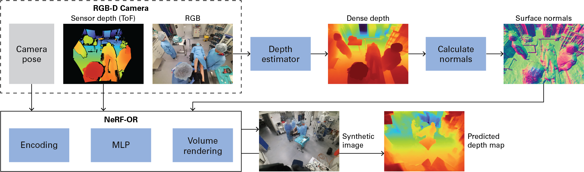

# NeRF-OR
This repository contains the code for training and evaluating NeRF-OR. The method is created for sparse-view dataset (e.g., with as few as three training views) without the requirement that the training cameras are positioned close to each other. Although NeRF-OR is designed to work with challenging camera setups that are typical for operating room videos, the method is applicable to other sparse-view datasets as well. Key to the method's design is the supervision with time-of-flight sensor depth combined with dense depth maps created by a monocular depth estimator from RGB images. This means that the method requires RGB-D recordings.



## ⚙️ Installation

### Conda
You can create the environment with Conda:
```
conda create -y -n nerfor python=3.8
conda activate nerfor
conda install -y numpy imageio imageio-ffmpeg matplotlib tqdm opencv imagecodecs -c conda-forge
conda install -y configargparse scikit-learn scikit-image -c anaconda
```
Install PyTorch and LPIPS with pip:
```
pip3 install torch==1.11.0+cu113 torchvision==0.12.0+cu113 -f https://download.pytorch.org/whl/cu113/torch_stable.html
pip3 install lpips
```
### Versions
The code was developed and tested with the following versions:
- Conda: 4.9.2
- CUDA: 11.3
- PyTorch: 1.11.0

### Marigold
We used Marigold as depth estimator from RGB images. You can follow the instructions [here](https://github.com/prs-eth/Marigold) for an installation.

## 📄 Datasets
Instructions for downloading the datasets can be found [here](https://github.com/egeozsoy/4D-OR) for the 4D-OR surgical scenes dataset and [here](https://github.com/Wanggcong/SparseNeRF) for the NVS-RGBD sparse-view benchmark dataset.

## 🚀 Usage
Choose or adapt a config file that is located in the ```configs``` folder. Thereafter, run the model:
```
python3 -u run_nerfor.py --config configs/4D-OR/static/take1_frame_001.txt
```

## ⭐ Acknowledgements
- This repository was cloned and adapted from [HashNeRF-pytorch](https://github.com/yashbhalgat/HashNeRF-pytorch/tree/main).
